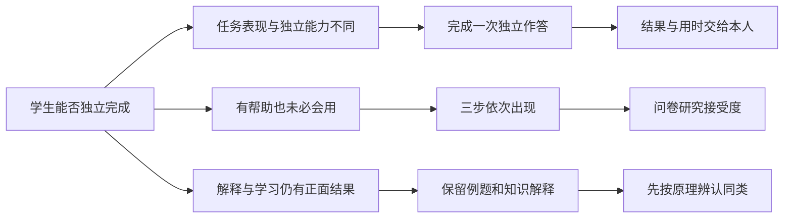

# 学会了吗 · 八组研究结论与设计定位

## 结论

把看懂解答、按原理归类和独立作答连成一次完整练习，将结果直接呈现给学习者。项目使用已有研究方法，研究连续流程的接受度与使用表现，不把“再次练习”或“预测与结果对照”宣称为独创。

## 八组研究结论

### A · 完成作业，不等于能独立做题

**有 AI 时的成绩与撤去 AI 后的表现，需要分开看。**

L01、L02、L24、L25 分别从平台记录、随机实验和中国中学生追踪数据观察这一差别。用时缩短与独立表现下降在部分研究中同时出现，但用时本身不能判断一个人是否学会。

设计选择：安排一次独立作答，并同时呈现答案、用时和作答前的把握。

来源：L01 L02 L24 L25。

### B · 有学习引导，也不保证学生会使用

**五项研究否定的是“加上引导就足够”，并非否定引导教学。**

Khanmigo 的两年试验中，96% 的学生至少尝试过；中位学生只在约三分之一的练习日发消息；做错题的练习会话中，使用比例为 17%。其余研究也发现，引导功能、提示训练或较好的使用感受，不必然带来额外知识增益。

设计选择：进入一次练习后，理解、归类、独立作答依次出现；学习者可以结束练习。

来源：L03 L04 L09 L25 L27。

### C · 设计得当的 AI 教学能够帮助学习

**效果取决于任务、使用方式和学生群体。**

Kestin 的大学物理实验发现 AI 导师组学得更快、更多；NUMI 数学实验发现，结构化支持尤其能帮助学生在出错后改正；Dai 的高中物理研究中，低分组从规定使用的启发式提示中受益，中等分组没有同样结果。

设计选择：保留解答与解释；把是否愿意继续、能否独立完成和成绩背景一起分析。

来源：L05 L06 L07 L14。

### D · 觉得看懂了，与实际会做可能不一致

**顺畅的解释可以提高理解感，却不能代替实际检验。**

L08 比较不同解释形式，发现主观理解与客观学习并不总是一致；L09 与 L27 也区分了当下任务表现、使用感受和实际知识。它们支持同时观察自评与作答，不能合并为一条已经证明的统一因果链。

设计选择：在新题出现前记录把握，完成后并列展示预测与结果。

来源：L08 L09 L16 L27。

### E · 比较预测与结果，是已有研究方法

**自评与表现的差值可以使用，但不是本项目独创。**

L17、L18、L19 与 L29 已研究自评准确性、相关训练及后续学习行为。一次答对或答错只描述这一次，不能据此给学习者贴上“过度自信”的标签。

设计选择：展示本次结果；问卷以两道题的正确比例作描述，不给出个人能力诊断。

来源：L08 L17 L18 L19 L29。

### F · 先尝试、再获得帮助、再独立检验，都有前例

**练习出现的位置和呈现方式会影响继续作答。**

L10 研究先尝试再问 AI；L11 研究随学习者表现调整帮助；L12 提出保留首次尝试和最终独立检验。L26 中，突出“再试一次”按钮使坚持度提高 9%，文字提示也有约 2% 的提升。按钮突出与强制完成是不同干预。

设计选择：采用连续的三步练习，同时研究学生对这一安排的接受度。

来源：L10 L11 L12 L26。

### G · 学习过程的结果，也应让本人读懂

**记录只有被理解，才能帮助学习者决定接下来练什么。**

L13 讨论学习过程可见性，L24 建议结合用时和小测观察学习；L28 所属的开放学习者模型传统，本来就重视让学习者查看自身记录。本项目延续这一方向，将归类、独立答案与用时放在同一页。

设计选择：结果先交给本人，可下载；页面不自动上传练习记录。

来源：L01 L13 L24 L28。

### H · 中国学生已经有多种获得答案的途径

**题目和解析容易取得，产品还需帮助学生判断自己是否学会。**

15 款产品的官方介绍包含拍照解题、分步解释、视频、关联练习及整本答案等功能。中国情境资料同时呈现独立思考、作业负担与考试压力。语料提供题目和考点关联，但自动标注不能直接视为标准答案。

设计选择：使用初中数学、普通中文和完整题干；按不同成绩背景观察接受度。

来源：M01 M02 M03 M05 A01–A15。

## 证据如何支持设计

## 已有研究或产品覆盖的 11 项工作

| 工作 | 来源 |
|---|---|
| 撤去 AI 后测独立表现 | L01 L02 L25 |
| 用作答时间观察学习行为 | L01 L24 |
| 比较自评与实际结果 | L08 L19 |
| 训练更准确的自我判断 | L17 L29 |
| 答错后鼓励再试一次 | L26 |
| 先独立尝试再问 AI | L10 |
| 根据表现逐步减少帮助 | L11 |
| 呈现学习过程 | L13 |
| 保留首次尝试与最终独立检验 | L12 |
| 提供同类题和变式练习 | A01 A02 A03 A05 A06 |
| 通过追问和提示引导解题 | A02 L04 |

## 五项确定的设计选择

五项共同构成本项目的设计范围。“设计空间”指此次调研未确认相同的完整组合；相关方法各有前例，项目效果尚待验证。

### 连续完成三步

将理解、归类和独立作答放进一次完整练习；中途可以退出，完成记录须经过三步。

依据与边界：L04 的低使用率与 L26 的按钮实验提示：呈现方式值得研究。它们尚未证明本项目的连续流程有效。

### 把结果交给本人

在同一页呈现归类选择、独立答案、把握和用时，并提供下载。

依据与边界：延续开放学习者模型和过程记录的研究，将这些记录组织成学习者可读的反馈。

### 先判断题目为何同类

解新题之前，先辨认是否使用同一种原理，再查看解释。

依据与边界：借鉴 Chi 等关于按原理分类的研究。AI 也能分类，因此任务只有在本人作答时才能反映本人的判断。

### 把题目与知识联系起来

第一步说明考查的知识、做法和常见误区，再用完整例题解释。

依据与边界：题库和教辅的知识层次提供内容依据。现有语料不支持完整、可靠的课标逐条对应，页面只展示已核对的内容。

### 覆盖不同成绩背景

面向会使用搜题或 AI 的学生，保留成绩位置作为分析维度，不只招募某一成绩段。

依据与边界：L24 的高分学生结果与 L14 的低分组受益来自不同研究，不能据此预定哪一组最适合本项目。

## 研究方案

问卷面向 13–22 岁，重点分析 16–22 岁；保留成绩背景，不只招募高分或低分学生。记录日常做法、归类选择、两道题的独立答案、预测和流程接受度。约 30 份自选样本用于描述与设计改进，不作因果判断。连续流程是否比可选按钮有效，需要另设行为对照和延迟测验。

17% 是出错会话中的工具使用比例；+9% 是突出按钮对继续尝试的影响；64→45 分钟是另一研究的作业用时。三个数字不能连接成对本产品的效果证明。
